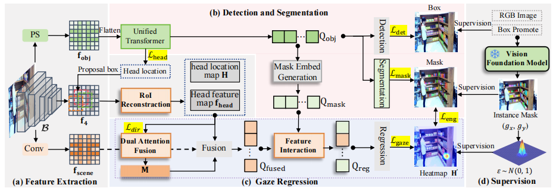

## Boosting Gaze Object Prediction via Pixel-level Supervision from Vision Foundation Model
This repository is the official implementation of "Boosting Gaze Object Prediction via Pixel-level Supervision from Vision Foundation Model"



## Data Preparation
We train our model on GOO-Real and GOO-Synth datasets respectively

You can download GOO-synth from OneDrive:

Train:
[part1](https://mailnwpueducn-my.sharepoint.com/:u:/g/personal/yangle_nwpu_mail_nwpu_edu_cn/ESk3KTXgDSFMmVcBW_EMAssBvxBf-eBSMK39g8yqFlRVgA?e=dSIXsd),
[part2](https://mailnwpueducn-my.sharepoint.com/:u:/g/personal/yangle_nwpu_mail_nwpu_edu_cn/EVoQzdFRQ85Bok0tmVpPLLcBk-adZBEcuRa-xp20sxVICw?e=hq5bwi),
[part3](https://mailnwpueducn-my.sharepoint.com/:u:/g/personal/yangle_nwpu_mail_nwpu_edu_cn/EUHIrsNLq_pHm2s7E8V9O5IBWBmvf5qI9jFue7wYOVNhyw?e=GYbTaW),
[part4](https://mailnwpueducn-my.sharepoint.com/:u:/g/personal/yangle_nwpu_mail_nwpu_edu_cn/EVTOQM6kkFJJm5v_h7K8r88BF2RlXa76DfE88v3rJkw70Q?e=NPuBzO),
[part5](https://mailnwpueducn-my.sharepoint.com/:u:/g/personal/yangle_nwpu_mail_nwpu_edu_cn/ESLLYmaimxlIgCW4Hy_Q9LMBrMS6ouPsAwWDYf7kUStElA?e=bKvZYd),
[part6](https://mailnwpueducn-my.sharepoint.com/:u:/g/personal/yangle_nwpu_mail_nwpu_edu_cn/ETevP-Nko6BAjBTidy-YsIYB8_145u7SeISKYtIr4AqKVg?e=0o9GOq),
[part7](https://mailnwpueducn-my.sharepoint.com/:u:/g/personal/yangle_nwpu_mail_nwpu_edu_cn/EUhglUujYbFIqYEOSgp5R5kBVZqvz0a4GdGogqlXXm1JAA?e=30ysd6),
[part8](https://mailnwpueducn-my.sharepoint.com/:u:/g/personal/yangle_nwpu_mail_nwpu_edu_cn/EY5AI0TLdrtMkN_pqV3FOzABtSPlnDOcjNT7QMEtDC5iXg?e=zI13Cp),
[part9](https://mailnwpueducn-my.sharepoint.com/:u:/g/personal/yangle_nwpu_mail_nwpu_edu_cn/EXHwQT0GRStFqSML6s8uW6kBLuFF8VjTf_opBg_ivtbUBQ?e=e0Agrv),
[part10](https://mailnwpueducn-my.sharepoint.com/:u:/g/personal/yangle_nwpu_mail_nwpu_edu_cn/EZ1LC_GF9a9EtUnofjLUtW4Bhb_-dg2bSgx6UYGS1piLrA?e=yawdDf),
[part11](https://mailnwpueducn-my.sharepoint.com/:u:/g/personal/yangle_nwpu_mail_nwpu_edu_cn/ERLtx5hBM5tLtUPAjs2yvYgBQ8CrEW4S8zd9HKzow7jX2w?e=BTCvl6)


Test:
[GOOsynth-test_data](https://mailnwpueducn-my.sharepoint.com/:u:/g/personal/yangle_nwpu_mail_nwpu_edu_cn/EQ5DC43-aYVOt3-Jmy5ZIscBFd0yGvVeyiWOoHLFwZsJ4Q)

Annotation file:

[GOOsynth-train_data_Annotation](https://mailnwpueducn-my.sharepoint.com/:u:/g/personal/yangle_nwpu_mail_nwpu_edu_cn/ET6h-STtBiVIn7jpwOP8bzEB__u-FEmwT8wXLKtTUw865g)

[GOOsynth-test_data_Annotation](https://mailnwpueducn-my.sharepoint.com/:u:/g/personal/yangle_nwpu_mail_nwpu_edu_cn/EW3HgRNFGPVHmaoYeFwhY1gB8UxwdEWSr55UwDaxwYvp1w)

You can download GOO-Real from OneDrive:

Train:
[GOOreal-train_data](https://mailnwpueducn-my.sharepoint.com/:u:/g/personal/yangle_nwpu_mail_nwpu_edu_cn/ETjRM4To-QxNtp9a4hMTTVwBAfBJ8e6Hs7TNv5RzsJgj2w)

Test:
[GOOreal-test_data](https://mailnwpueducn-my.sharepoint.com/:u:/g/personal/yangle_nwpu_mail_nwpu_edu_cn/EXlBBBnd2khPk7S0_FKKGtQBCoIKoHSu7SmpdpxTAICpdw)

You can download GOO-Real annotations file from Baidu disk::

[GOOreal-train_data_Annotation](https://pan.baidu.com/s/1d-bgh5Kh3dKj8-d0mR1RnA) (code:4s36)

[GOOreal-val_data_Annotation](https://pan.baidu.com/s/1LvkbYuvnmgUzq7ot9RmNxg) (code:mx3c)

~~~~
If you want to train on GOO-Real or GOO-Synth dataset, please keep the data structure as follows:
├── datasets
   └── coco
      └── annotations
            └── cate.txt
            └── train2017.json
            └── val2017.json
      └── train2017
            ├── 0.png
            ├── 1.png
            ├── ...
      └── val2017
            ├── 3609.png  
            ├── 3610.png
            ├── ...
~~~~

## Environment Preparation

### Create conda environment
```bash
cd SamGOP
conda create --name samgop python=3.8 -y
conda activate samgop
conda install pytorch==1.9.0 torchvision==0.10.0 cudatoolkit=11.1 -c pytorch -c nvidia
pip install -U opencv-python

# under your working directory
cd detectron2
pip install -e .
```

### Install Requirements
```bash
cd ..
pip install -r requirements.txt
```


### CUDA kernel for MSDeformAttn
```bash
cd maskGOP/modeling/pixel_decoder/ops
sh make.sh
```

## Training & Inference
To carry out experiments, please follow these commands:
```train
python train_net.py --num-gpus 1 --config-file ./configs/coco/instance-segmentation/maskGOP_R50_bs2_75ep_3s.yaml SOLVER.IMS_PER_BATCH 2 SOLVER.BASE_LR 0.0001
```
To eval the model, please follow these commands:
```eavl
python eavl_train_net.py --eval-only --num-gpus 1 --config-file ./configs/coco/instance-segmentation/maskGOP_R50_bs2_75ep_3s.yaml MODEL.WEIGHTS weights_path
```

## Our Model


## Acknowledgements
Our implamentation is based on [detectron2](https://github.com/facebookresearch/detectron2) and [maskdino](https://github.com/facebookresearch/detectron2)
